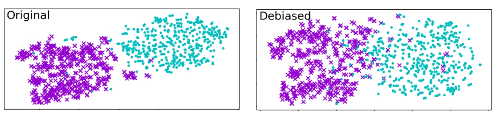
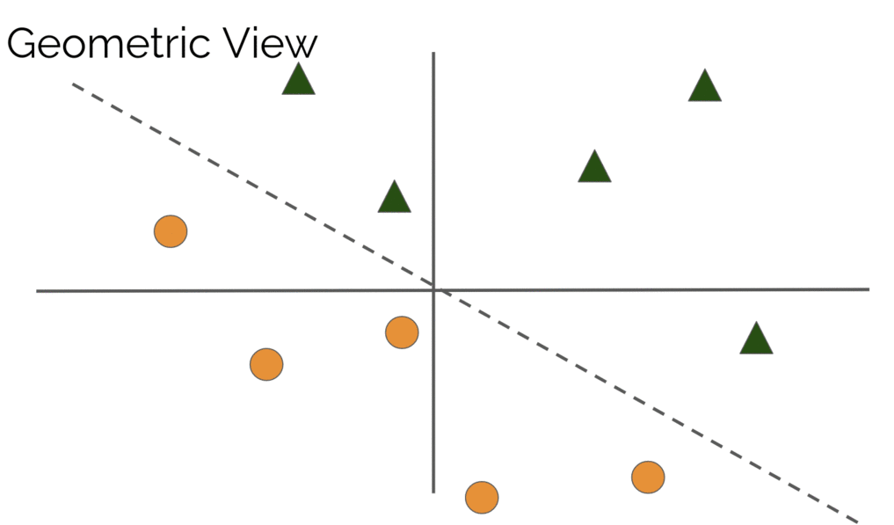
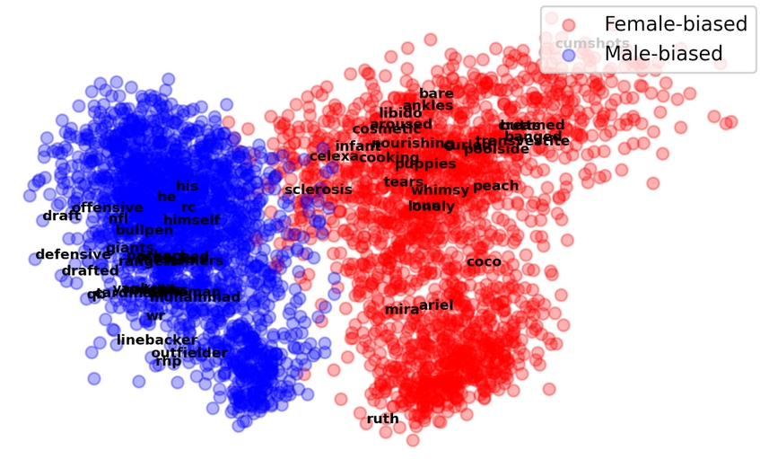
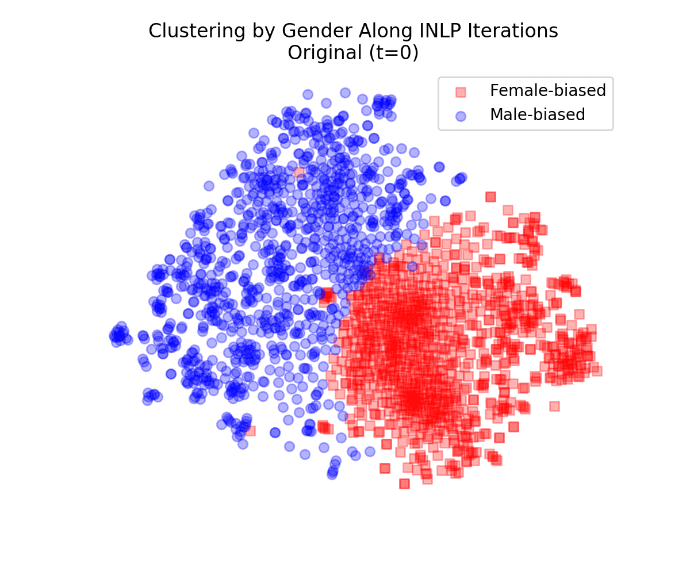
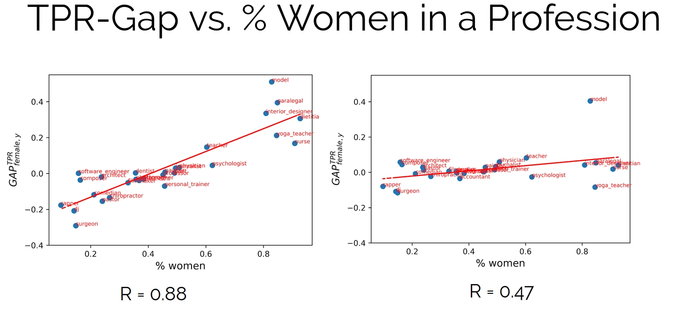
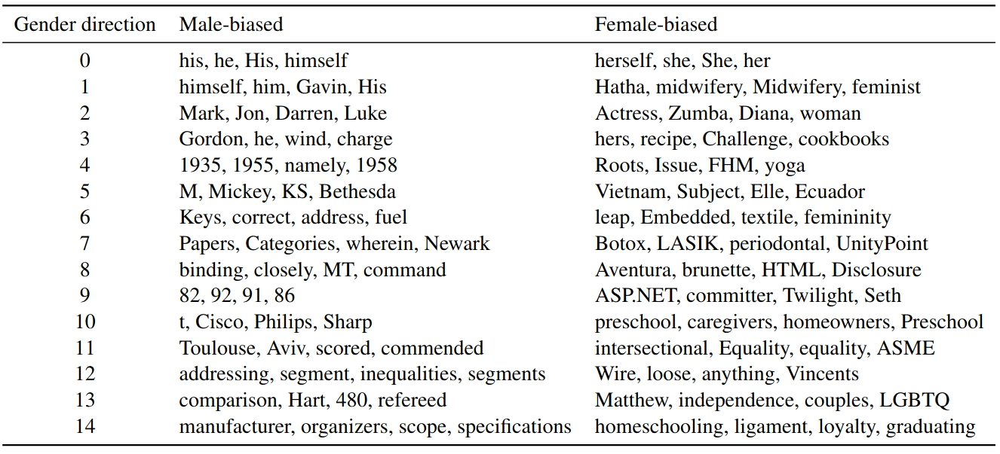

  

$ g = f(x) $ 

$ h = f(x) $

**Yanai Elazar and Shauli Ravfogel**

## Calling neural models to order

Neural models are notoriously opaque. While in recent years we witnessed an array of increasingly powerful models -- from word representations to contextualized transformers -- that capture many aspects of human language, ranging from the structural aspects of syntax, to more high level semantic aspects. But what can we do if we want to make sure that something is not encoded in the model? This requirement arises in multiple scenarios. For example, we may want to have word embeddings that focus on lexical semantics, but discard the syntactic distinctions that are often encoded in the embeddings (e.g. tense); and to ensure fairness, we may want to have models that do not encode gender-related concepts. 

A natural way to approach this is having a preprocessing step for the training data, which eliminates the distinctions we do not want to encode: in our embedding-tense example, this can be lemmatization. While this solution is applicable in simple cases such as removing tense distinctions, it becomes much less practical when working with pretrained contextualized models, such as BERT, and when trying to eliminate more vague information such as gender distinctions. First, re-training large language models on new datasets is often impractical for standard practitioners. More importantly, it is not clear how to pre-process the training data, to remove gender distinctions: we first have to understand which parts of the input are causally responsible for the gender components in the encoding, and how to neutralize them. As we are about to see, societal concepts such as gender and race are deeply rooted in representations trained on neutral-language corpora, and are often represented in implicit and opaque ways. Naively removing gendered pronouns and first names from the training corpus does alleviate the problem, but this is far from a complete solution.

## Existing approaches

In recent years, a large body of work has shown that neural models capture subtle cues for protected attributes, such as the gender or the race of the person that wrote the text, of the text’s focus. The first works have focused on word embeddings, and they have shown that (link) word embeddings capture and amplify many statistical differences between groups, that are reflected in the training corpora. For example, due to the imbalance between men and women in STEM fields, the representation of STEM fields such as mathematics is closer to male names than to female names. While this reflects an existing statistical tendency, the models can further amplify this trend (cite); moreover, they can encourage the persistence of this imbalance, by causally influencing real-word decisions., for example, a CV-filtering system that is based on word embeddings, might consider the application of a female nuclear physicist an unlikely event.

For word embeddings, one primary post-hoc “debiasing” method is the projection-based method of Bolukbasi et al. They aim to identify a gender direction in the embedding space, and neutralize it. Consider the direction defined as the difference between two inherently-gendered pairs, such as he-she. Subtraction of the two parallel but opposite words should leave us with a direction that supposedly (one) aspect of gender in the embedding space. We can delete the projection of each word embedding on this direction, and neutralize that aspect of gender. If one defines the gender content of an embedding as this projection, then we are done. However, Gonen and Goldberg have shown that this is not the case: even after we neutralize this direction, word vectors are still clustered very well by gender: as we are going to see, gender is encoded in multiple directions, not all of them as interpretable as the he-she direction.

When focusing on deep models, on the other hand, projection based methods are much less popular than adversarial training, where we regularize the training with an adversary which tries to predict the protected attributes from the hidden representations of the main-task models. Adverserial method show impressive performance in many tasks, such in domain adaptation (cite, ganin et al.) for reducing the variability between domains. A similar approach was used to neutralize demographic features in the representations (e.g.  [1](https://www.aclweb.org/anthology/P18-2005.pdf), [2](https://www.aclweb.org/anthology/D18-1001.pdf), [3](http://papers.nips.cc/paper/6661-controllable-invariance-through-adversarial-feature-learning.pdf)).

However, Elazar and Goldberg have [shown](https://arxiv.org/pdf/1808.06640.pdf) that even though using adversarial training for some protected attribute, this method does not completely remove all the information through a post-hoc classifier.

To conclude, existing approaches mostly use either use projection-based debiasing, which is simple and elegant - but limited in power as it is based on neutralizing few human-defined “gender direction” -- or adverserial methods, which are data driven and nonlinear, but are opaque and were shown to be not exhaustive. Can we enjoy the benefits of both worlds?

## Enter Iterative Nullspace projections

We propose a method that generalizes the previous projection-based methods, and exposes their true potential. Unlike previous methods ,we do not presuppose a few “gender directions”, but rather learn them from the data; and we perform an iterative process which aims to remove all gender directions. We begin with an intuitive description of our approach. Consider a linear probe model that is trained to predict gender from a representation. The model is parameterized by a matrix (or, in the binary case, a vector) W that can be interpreted as conveying information on directions in the latent space which are predictive of gender. If we could neutralize those directions, we could eliminate the main features in the representation which encode gender.

Luckily, when using linear probes, linear algebra is equipped with a simple operation that does just that: projection to the nullspace of W. Recall that the nullspace of W Is defined as N(W) = {x|Wx = 0}, ie all vectors in the nullspace are mapped by W to the zero vector, and are orthogonal to W. They thus convey no information that is relevant to gender classification. If we took the representation x and orthogonally projected it onto N(W), we’d end up with the closest point to the original x that is within the nullspace, and we’d neutralize the gender features used by W. 

Empirically we find that the latent space is approximately linearly separable by gender according to multiple different orthogonal planes. So we just repeat the process: we learn the first gender probe W1, calculate its nullspace N(W1) and the projection P_N(W1) onto the nullspace, project the data to get a first “debiased” version P_N(w1)X, and then train the second gender classifier W2, its nullsapce N(W2) and projection P_N(W2), apply it to get a second “debiased” version of the data P_N(W2)P_N(w1)X, and so forth. We continue this process until no linear probe achieve above random accuracy. At this point we return the final “debiasing” projection P=Pn...P2P1. This is the essence of our algorithm, which we call **Iterative Nullsapce Projection (INLP)**.

But what about deeper models? we take use of the fact they can be decomposed into a deep encoder and a final linear layer. We apply INLP on the final hidden representaton, and potentially perform finetuning of the last linear layer afterwards. Since it's linear, and INLP projection is not invertible, the linear layer cannot recover the removed information.

We test our method on increasingly complex settings: debiasing static word embeddings, deep binary classification and deep multiclass classification. 

### "Debiasing" word embeddings

We begin with removing gender associations from GloVe word embeddings. Following previous works, we annotate word vectors by gender bias according to their projection on the he-she. Initially, word vectors are clustered by gender bias:

The following animations displays consecutive T-sne projections along the running of INLP. It is evident that the vectors become increasingly mixed, and are no longer clustered by gender. We also quantified this effect using a measure for cluster purity. 

Finally, we used WHEAT to measure whether the transformed vectors still show undesired associations between socially-biased terms and female and male names. Those associactions became insificant following INLP.

### Dataset bias vs model bias

We continue with a more realistic --- but still controlled --- scenario, where we make use of [DeepMoji](https://arxiv.org/abs/1708.00524) to encode tweets, which are associated with the author's race identity. Moreover, each tweet is also associated with a "sentiment" which is achieved through emojis (following the setup in [Elazar and Goldberge (2018)](https://arxiv.org/pdf/1808.06640.pdf)). We experiment with multiple setups where the labels proportion differ, in order to see how imbalanced setting affect the TPR-Gap.

We measure the TPR-Gap after employing a standard MLP on the DeepMoji's representation, with and without INLP, and observe improvements for this measure, with minor-to-moderate performance loss to the sentiment task.

### Debiasing: in the wild

Finally, we test our method on a multi-class fair classification setting. We user the profession-prediction datasets presented in [De-Arteaga et al. (2019)](https://arxiv.org/pdf/1901.09451.pdf). The dataset contain short biographies, divided into 28 professions and annotated by gender. They have shown that models trained on this dataset tend to condition on gender. We use 3 models: bag of words, bag of word vectors, and BERT. In all cases, we perform INLP on the last hidden representation, and then finetune the last linear layer. The method decreases the True Positive Rate Gap (TPR-Gap) between men and women, and the correlation between the bias and the percentage of women in each profession is mitigated:

We noted earlier that in INLP we treat the classifiers we train for the prediction of the protected attributes, as conveying information on latent features that are correlative to the propety we focus on. We can emrbace this view to shed light on the *different facets by which gender bias is manifested in neural models*. We used the bag-of-word-embeddins model for the biographies dataset, and inspect the top 15 gender directions identified by INLP. we then inspect the closest words to each of those directions:

Interestingly, many of of the directions are interpretble: the first direction seems to capture gendered pronouns; the third ones -- first names ,and other gendered words; and more. At the same times, some gender associations are harder to interpret, for instance the association between "manufacturer", "specifications" and "addressing" with male biographies. It is not clear if those represent merely spurious correlations, or whether they reflect actual subtle differences between the biographies of men and women. 

## What's next?

We have identified two key weaknesses of previous projection-based information-removal methods, and proposed a new method which is both data-driven and exhaustive. We see this method as a strong alternative to adversarial removal of information: while we focused on gender as a case study, we can use INLP to selectively remove any kind of information from representations, in a controlled manner - provided that we have annotation for that property.

Moreover, one can use INLP to study the information we focus on, rather than to neutralzie it. Recall that in INLP we identify a set of directions in the latent space which correspond to the protected attribute. While in the conventional use we discard those directions, we can alternatively discard all *other* directions, maintaining only the components of the representation space that are related to it. Under this setting, *INLP serves as a supervised dimensionality reduction method: we distill the part of the representaton we are interested in*. This can have multiple use cases: exploring BERT's "syntactic subspace" (e.g. by using INLP to find the subsapce that encodes dependency edge identity); analsying BERT "gender subspace" (which sentences are close in that subspace, but not necessarily in the original representaton space?); and more. 

\- limitations

\- hint to amnesic probing